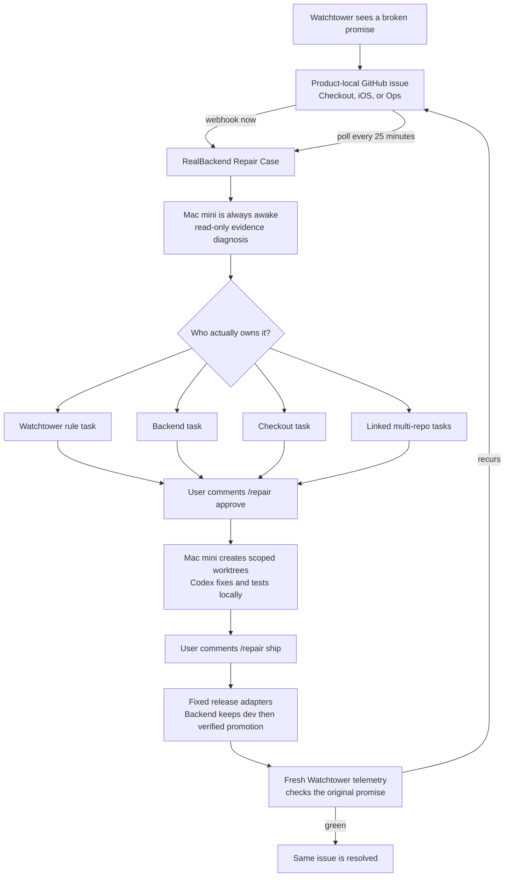

# Watchtower Repair Orchestrator

## The simple picture



The Mac mini is the only computer that must stay awake. GitHub keeps the original problem in the product repository where people expect to find it. RealBackend remembers one durable Repair Case and links every owning repository task to it. The Mac mini first reads all relevant repositories and evidence without changing anything. The user approves preparation in GitHub, then separately approves shipping after the tested local commits are visible. A release is not called fixed until Watchtower sees fresh evidence that the original promise recovered. If the same fingerprint returns, the same case and issue are updated instead of creating a stale duplicate.

## What is implemented

- Stable Repair Cases with recurrence count, evidence-backed route, approvals, child repository tasks, releases, and verification proof.
- Signed GitHub webhook intake with delivery idempotency.
- A 25-minute Mac mini poll fallback for new/reopened `watchtower` issues and exact repair commands.
- Evidence routes: `watchtower`, `backend`, `checkout`, `multi_repo`, or `needs_evidence`.
- Exact allowlisted commands: `/repair approve`, `/repair ship`, and `/repair status`.
- Scoped worktrees and local Codex commits only after prepare approval.
- Fixed local release adapters only after ship approval. Shipping is disabled in the example registry.
- A GitHub outbox so backend decisions are posted by the Mac mini's existing `gh` login.
- Independent recovery gating. A merge or deployment cannot resolve the issue by itself.

## Backend configuration

Set these as backend secrets, not in Git:

```dotenv
WATCHTOWER_REPAIR_OPERATOR_TOKEN=<random operator token>
WATCHTOWER_REPAIR_RUNNER_TOKEN=<different random runner token>
WATCHTOWER_GITHUB_SYNC_TOKEN=<existing issue sync token>
WATCHTOWER_GITHUB_WEBHOOK_SECRET=<random webhook secret>
WATCHTOWER_GITHUB_APPROVERS=unitedadi
WATCHTOWER_GITHUB_POLL_INTERVAL_MINUTES=25
WATCHTOWER_REPAIR_OWNER_REPO_CHECKOUT=unitedadi/dardoc-checkout
WATCHTOWER_REPAIR_OWNER_REPO_BACKEND=ado-dardoc/RealBackend
WATCHTOWER_REPAIR_OWNER_REPO_WATCHTOWER=unitedadi/watchtower
```

The backend migration is created idempotently by `ensureRepairCaseSchema()` and `ensureRepairOrchestratorSchema()`. Production activation still requires deploying this backend revision so those schema statements run against the configured production database.

## GitHub configuration

Create a repository webhook in each observed product repository:

- Checkout: `unitedadi/dardoc-checkout`
- iOS: `unitedadi/DarDoc-App-2026`
- Ops: `unitedadi/dardoc-ops-portal`

Use the callback:

```text
https://api-prod.dardoc.com/integrations/watchtower/github
```

Use `application/json`, the same value as `WATCHTOWER_GITHUB_WEBHOOK_SECRET`, and enable only:

- Issues
- Issue comments

The callback is not live until the backend is deployed, its secret is configured, and GitHub reports a successful signed delivery. The poller remains the fallback and uses the Mac mini's `gh` authentication.

## Mac mini setup

1. Put the Watchtower checkout at `/Users/mini/codex-runner/watchtower`.
2. Copy `runner/.env.example` to `/Users/mini/codex-runner/config/watchtower-repair.env` and fill only local secrets and paths.
3. Copy `runner/repos.example.json` to `/Users/mini/codex-runner/config/watchtower-repos.json`.
4. Confirm each mirror exists and its configured base branch is correct.
5. Keep every `ship.kind` as `disabled` until the exact fixed adapter has been reviewed.
6. Make `runner/watchtower-repair-service.sh` executable.
7. Copy the two `.plist.example` files to `~/Library/LaunchAgents/`, remove `.example`, and load them with `launchctl bootstrap gui/$(id -u) <plist>`.

The worker runs every minute. The fallback poller runs every 1,500 seconds, which is 25 minutes. The laptop may be off.

### Release adapters

`command` runs one absolute, locally configured executable. GitHub comment text is never used as a command or argument.

RealBackend must use `realbackend_verified_promotion`, with three fixed commands:

1. ship the prepared commit to `dev`;
2. verify the deployed dev revision and required smoke;
3. promote the verified dev commit to production.

Do not configure a direct production command for RealBackend.

When an external CI pipeline owns deployment, it can report the result to:

```text
POST /telemetry/repair-cases/:case_id/deployment-signals
Authorization: Bearer <WATCHTOWER_REPAIR_OPERATOR_TOKEN>
```

The signal must name the exact task and prepared commit. Backend tasks are
rejected unless the signal declares `adapter=realbackend_verified_promotion`
and `dev_verified=true`; this keeps the existing dev verification and
production promotion gate intact.

## GitHub mobile commands

| Command | Meaning | Valid only when |
|---|---|---|
| `/repair status` | Ask for current route, tasks, approvals, and verification | Any linked case |
| `/repair approve` | Allow scoped worktrees, edits, tests, and local commits | Evidence diagnosis is complete |
| `/repair ship` | Allow only configured push/deploy adapters | Every linked task has a tested local commit |

Only usernames in `WATCHTOWER_GITHUB_APPROVERS` are accepted. Extra text, shell syntax, and near matches are ignored.

## Local proof without external writes

```bash
npm run test:runner
npm run demo:repair
```

The runner tests use fake GitHub, fake Codex, local temporary Git repositories, and a fake backend. They prove read-only diagnosis, no push before ship approval, exact command polling, worktree isolation, and disabled-adapter blocking.

Backend proof:

```bash
npm test -- --run test/repairOrchestrator.test.ts test/repairCases.test.ts test/watchtowerGitHubIssues.test.ts
npm run build:backend
```

The orchestrator test uses the local test database and walks one linked backend plus Watchtower case through diagnosis, approval, local task completion, ship approval, release recording, fresh verification, and recurrence reopening.
